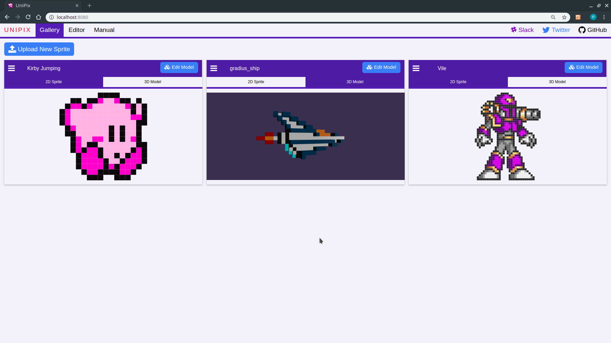
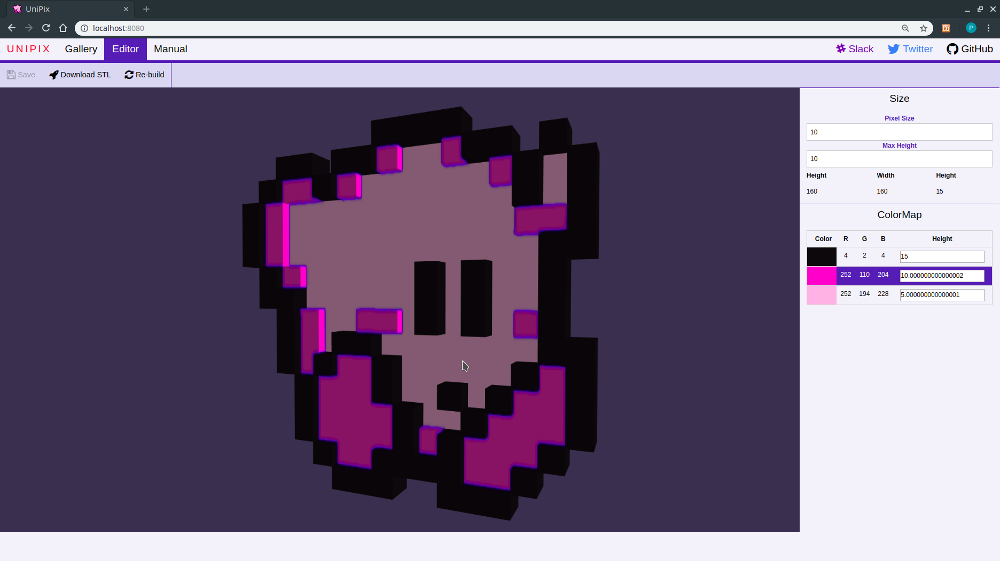

# :unicorn: UniPix :sheep: :rainbow:

**UniPix** is an OpenSource Web Application, powered by [Django](https://www.djangoproject.com/), [Vue.js](https://vuejs.org/) and [Babylon.js](https://www.babylonjs.com/), that allows you to convert 2D sprites and pixel arts into printable 3D models.

No modeling skill is required to build your unique model : you just need to set up pixel heights by color directly in the editor, to finally export .stl files that you can import in your favourite 3D slicer.

Check [the wiki](https://github.com/PaulBreugnot/UniPix/wiki) for a more complete manual.

# How to contribute ?

**UniPix** is currently developed and maintained by 1 or 2 people as a hobby, and even if we plan to include [many more cool features](#current-features) in the future, it is still at its beginning. The energy that we will invest in the project is highly dependent on the moral support of the community, so, even if you are not a developer, here are a few examples of how you can contribute to the project : 
- [x] Star the [GitHub repository](https://github.com/PaulBreugnot/UniPix)!
- [x] Follow progress on [Twitter](https://twitter.com/PaulBreugnot) !
- [x] Do not hesitate to report bugs or feature suggestions in the [GitHub issues section](https://github.com/PaulBreugnot/UniPix/issues) !
- [x] What about [joining us on Slack](https://join.slack.com/t/pixled/shared_invite/enQtNjYwMDczNTg3Mjk2LTJiMjZkMzhiZjgzYmVjNTgxZWViYmU3NjYzOWUzMWU5ZTQ4YmMyZjRiMzRjNjAxMjcxZTkwMTQyMmNkM2RmODM) ?

# Installation
## Get the project
From the directory of your choice :
`git clone https://github.com/PaulBreugnot/UniPix`

Or directly download and unzip this repository.

Notice that the application will upload and write files in the cloned repository, so you must have write access to the directory when the application is launched.

## pip
Make sure `pip` is installed and updated:
- Linux or Mac OS : `pip install -U pip`
- Windows : `python -m pip install -U pip`

## Dependencies
From the installation repository :
- Linux or Mac OS : `pip install -r requirements.txt`
- Windows : `python -m pip install -r requirements.txt`

## Create the database
From the installation repository :
> `python manage.py migrate`

(might be `python3` instead for some distributions)

# Get started
To launch the application, run `python manage.py runserver` from the installation directory, and **UniPix** should be available at `localhost:8000`!

# Current features
- [x] Import 2D sprites
- [x] Basic 3D model generation
- [x] Customize models by color
- [x] Export your model to an .stl file
- [x] Persist your creation in a local database
- [ ] Other 3D model generation algorithms
- [ ] Customize heights by areas
- [ ] Sprite collections management
- [ ] More export formats (.gltf, .step...)
- [ ] Online hosting
- [ ] A puzzle generator!
- [ ] Many more cool stuffs.

# :unicorn: Have Fun :sheep: :rainbow:
